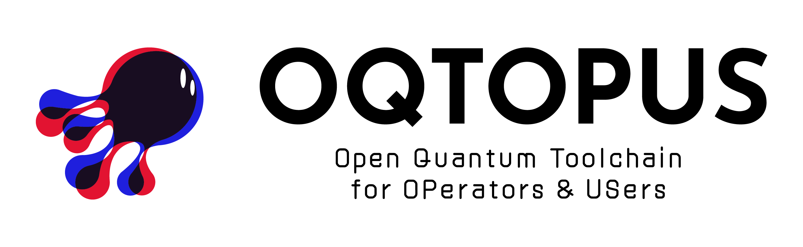

## Overview

**O**pen **Q**uantum **T**oolchain for **OP**erators & **US**ers (**OQTOPUS**) is a project that provides quantum computer systems as open-source software (OSS). With it, together with various OSS from the [@oqtopus-team](https://github.com/oqtopus-team), you can build a quantum computer system.

## Document

[OQTOPUS Project Site](https://oqtopus-team.github.io/)
